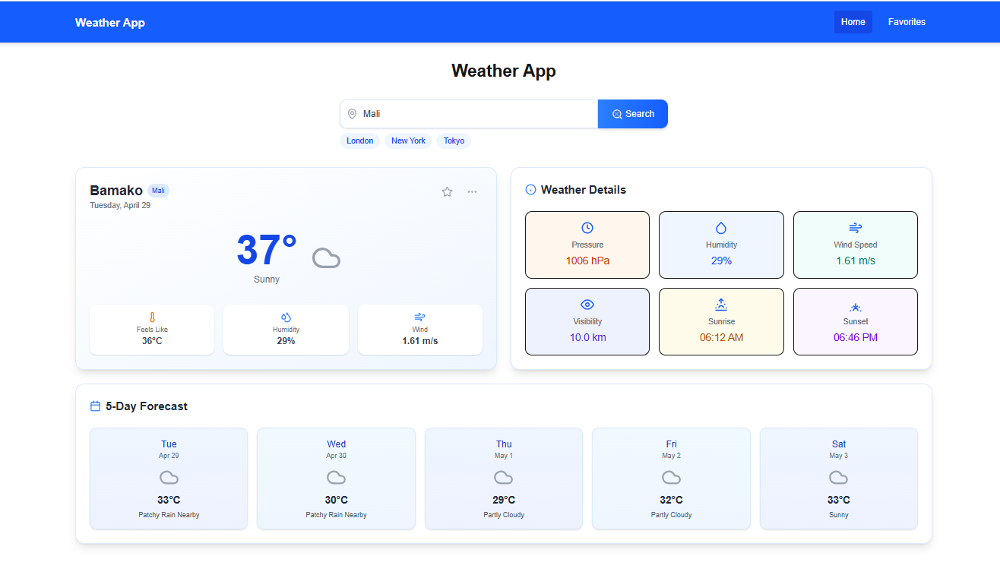

# Weather App

## Overview
A modern, responsive weather application built with Next.js that provides real-time weather data and forecasts for locations worldwide. The app leverages the WeatherAPI for accurate and up-to-date weather information.

## Features
- **Current Weather Display**: Temperature, humidity, wind speed, pressure, and weather conditions
- **5-Day Weather Forecast**: Daily weather predictions with temperature and conditions
- **Location Search**: Look up weather by city name
- **Favorites System**: Save and manage your favorite locations
- **Detailed Weather Information**: 
  - Feels like temperature
  - Humidity percentage
  - Wind speed
  - Atmospheric pressure
  - Visibility distance
  - Sunrise and sunset times
  - Cloud coverage
- **Responsive Design**: Optimized for desktop, tablet, and mobile devices
- **Quick Access Links**: Preset buttons for popular cities (London, New York, Tokyo)
- **Weather Visualization**: Custom icons representing different weather conditions

## Technologies Used
- **Next.js**: React framework for server-side rendering and routing
- **React**: Front-end UI library with hooks (useState, useEffect)
- **Tailwind CSS**: Utility-first CSS framework for styling
- **Lucide React**: Icon library for weather and UI elements
- **WeatherAPI**: Third-party API for weather data
- **Local Storage**: For saving favorite locations

## Component Structure
- **SearchBar**: Input field with quick-access city buttons
- **WeatherCard**: Displays main weather information and favorite toggle
- **WeatherDetails**: Shows additional weather metrics
- **Forecast**: 5-day weather prediction display
- **WeatherIcons**: SVG icon components for different weather conditions
- **Navbar**: Navigation between home and favorites pages

## Installation

1. Clone this repository
```bash
git clone https://github.com/aduuuna/FUTURE_FS_02.git
cd weather-app
```

2. Install dependencies
```bash
npm install
# or
yarn install
```

3. Create a `.env.local` file in the project root and add your WeatherAPI key:
```
WEATHER_API_KEY=your_weather_api_key
```

4. Run the development server
```bash
npm run dev
# or
yarn dev
```

5. Open [http://localhost:3000](http://localhost:3000) in your browser

## API Integration
The app integrates with [WeatherAPI](https://www.weatherapi.com/) to fetch:
- Current weather conditions
- 5-day weather forecasts
- Location data
- Astronomical data (sunrise/sunset)

The API route in `route.js` handles fetching and formatting the weather data to maintain compatibility with the front-end components.

## Usage
- Enter a city name in the search bar or click on a preset city button
- View current weather conditions and forecast
- Click the star icon to add locations to favorites
- Navigate to the Favorites page to view and manage saved locations
- Click "View Full Details" on favorite locations to see comprehensive weather information

## Screenshots




## Future Enhancements
- Weather alerts and notifications
- Weather maps integration
- Weather history data
- Location auto-detection using geolocation
- Additional unit options (Fahrenheit/Celsius toggle)
- Dark/Light mode theme switch
- PWA capabilities for offline access

## Contributing
Contributions are welcome! Please feel free to submit a Pull Request.

1. Fork the repository
2. Create your feature branch (`git checkout -b feature/amazing-feature`)
3. Commit your changes (`git commit -m 'Add some amazing feature'`)
4. Push to the branch (`git push origin feature/amazing-feature`)
5. Open a Pull Request

## License
This project is licensed under the MIT License - see the LICENSE file for details.

## Acknowledgments
- [WeatherAPI](https://www.weatherapi.com/) for providing the weather data
- [Lucide React](https://lucide.dev/) for the beautiful icons
- [Tailwind CSS](https://tailwindcss.com/) for the styling framework
- [Next.js](https://nextjs.org/) for the React framework